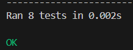
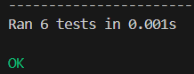

# Лабораторная работа № 1

## Ряд Фибоначчи с помощью итераторов
## Задание 1

### Постановка задачи  
Создайте класс, который перебирает список чисел и выдаёт только числа Фибоначчи.
Сделайте это двумя способами: через методы `__iter__` и `__next__`, а также через метод `__getitem__`.
### Код  
```python
from typing import List, Iterable, Iterator, Set


def _generate_fib_set(max_val: int) -> Set[int]:
    """
    Сгенерировать множество чисел Фибоначчи до max_val.

    Аргументы:
        max_val: Максимальное значение для поиска чисел Фибоначчи.

    Возвращает:
        Множество чисел Фибоначчи.
    """
    if max_val < 0:
        return set()

    fibs = {0, 1}
    a, b = 0, 1
    while b <= max_val:
        a, b = b, a + b
        fibs.add(a)
    return fibs


class FibonacciList:
    """
    Итератор для фильтрации чисел Фибоначчи из списка.
    Реализация через протокол итератора (__iter__, __next__).
    """

    def __init__(self, instance: Iterable[int]) -> None:
        """
        Инициализировать итератор.

        Аргументы:
            instance: Входной список чисел.
        """
        self.instance = list(instance)
        self.idx = 0
        if self.instance:
            self.fib_set = _generate_fib_set(max(self.instance))
        else:
            self.fib_set = set()

    def __iter__(self) -> Iterator[int]:
        """Вернуть сам объект итератора."""
        return self

    def __next__(self) -> int:
        """
        Вернуть следующий элемент списка, являющийся числом Фибоначчи.

        Возвращает:
            Следующее число Фибоначчи.

        Исключения:
            StopIteration: Если элементы закончились.
        """
        while True:
            if self.idx >= len(self.instance):
                raise StopIteration

            value = self.instance[self.idx]
            self.idx += 1

            if value in self.fib_set:
                return value


class FibonacciListGetItem:
    """
    Итератор через протокол последовательности (__getitem__).
    Позволяет обращаться к объекту как к списку.
    """

    def __init__(self, instance: Iterable[int]) -> None:
        """
        Инициализировать объект.

        Аргументы:
            instance: Входной список чисел.
        """
        self.instance = list(instance)
        if self.instance:
            self.fib_set = _generate_fib_set(max(self.instance))
        else:
            self.fib_set = set()

        self._filtered_data = [x for x in self.instance if x in self.fib_set]

    def __getitem__(self, index: int) -> int:
        """
        Вернуть элемент по индексу.

        Аргументы:
            index: Индекс элемента.

        Возвращает:
            Число Фибоначчи.

        Исключения:
            IndexError: Если индекс выходит за границы.
        """
        return self._filtered_data[index]

    def __iter__(self) -> Iterator[int]:
        """Сделать объект итерируемым через __getitem__."""
        return iter(self._filtered_data)
```

### Тест 
```python
import unittest
from fib_iterator import FibonacciList, FibonacciListGetItem


class TestFibIterator(unittest.TestCase):
    """Тесты для итератора FibonacciList."""

    def test_normal(self):
        result = list(FibonacciList(list(range(10))))
        self.assertEqual(result, [0, 1, 2, 3, 5, 8])

    def test_with_duplicates(self):
        lst = [0, 1, 2, 3, 4, 5, 6, 7, 8, 9, 1]
        result = list(FibonacciList(lst))
        self.assertEqual(result, [0, 1, 2, 3, 5, 8, 1])

    def test_corner_empty(self):
        result = list(FibonacciList(list(range(0))))
        self.assertEqual(result, [])

    def test_corner_zero(self):
        result = list(FibonacciList(list(range(1))))
        self.assertEqual(result, [0])

    def test_corner_one(self):
        result = list(FibonacciList(list(range(2))))
        self.assertEqual(result, [0, 1])


class TestFibIteratorGetItem(unittest.TestCase):
    """Тесты для итератора FibonacciListGetItem."""

    def test_normal(self):
        result = list(FibonacciListGetItem(list(range(10))))
        self.assertEqual(result, [0, 1, 2, 3, 5, 8])

    def test_index_access(self):
        obj = FibonacciListGetItem(list(range(10)))
        self.assertEqual(obj[0], 0)
        self.assertEqual(obj[4], 5)

    def test_corner_empty(self):
        result = list(FibonacciListGetItem([]))
        self.assertEqual(result, [])


if __name__ == '__main__':
    unittest.main()
```

### Результат


---
## Задание 2

### Постановка задачи  
Разработайте сопрограмму, которая принимает число `n` через `send()` и возвращает первые `n` чисел Фибоначчи. Сделайте так, чтобы генератор не перезапускался, а продолжал работу после каждого запроса.
### Код  
```python
import functools
from typing import Generator, List, Callable


def fib_elem_gen() -> Generator[int, None, None]:
    """
    Сгенерировать бесконечный ряд чисел Фибоначчи.

    Возвращает:
        Следующее число ряда Фибоначчи (через yield).
    """
    a, b = 0, 1
    while True:
        yield a
        a, b = b, a + b


def fib_coroutine(func: Callable[..., Generator[List[int], int, None]]) -> Callable[..., Generator[List[int], int, None]]:
    """
    Активировать корутину автоматически.
    Вызывает gen.send(None) сразу после создания генератора.

    Аргументы:
        func: Функция-генератор.

    Возвращает:
        Обернутая функция.
    """
    @functools.wraps(func)
    def inner(*args: any, **kwargs: any) -> Generator[List[int], int, None]:
        gen = func(*args, **kwargs)
        gen.send(None)
        return gen
    return inner


@fib_coroutine
def my_genn() -> Generator[List[int], int, None]:
    """
    Принять число n и вернуть список чисел Фибоначчи.
    Сопрограмма для двустороннего обмена данными.

    Возвращает:
        Список чисел Фибоначчи (через yield).

    Принимает:
        Количество элементов (int) через send().
    """
    number_of_fib_elem: int = yield []

    while True:
        result: List[int] = []
        a, b = 0, 1
        for _ in range(number_of_fib_elem):
            result.append(a)
            a, b = b, a + b
        number_of_fib_elem = yield result
```

### Тест 
```python
import unittest
from fib_coroutine import my_genn


class TestFibCoroutine(unittest.TestCase):
    """Тесты для сопрограммы my_genn."""

    def test_fib_3(self):
        gen = my_genn()
        assert gen.send(3) == [0, 1, 1], "Тривиальный случай n = 3"

    def test_fib_5(self):
        gen = my_genn()
        assert gen.send(5) == [0, 1, 1, 2, 3], "Пять первых членов ряда"

    def test_corner_zero(self):
        gen = my_genn()
        self.assertEqual(gen.send(0), [])

    def test_corner_one(self):
        gen = my_genn()
        self.assertEqual(gen.send(1), [0])

    def test_corner_two(self):
        gen = my_genn()
        self.assertEqual(gen.send(2), [0, 1])

    def test_sequential_calls(self):
        gen = my_genn()
        self.assertEqual(gen.send(3), [0, 1, 1])
        self.assertEqual(gen.send(5), [0, 1, 1, 2, 3])
        self.assertEqual(gen.send(2), [0, 1])


if __name__ == '__main__':
    unittest.main()
```

### Результат

