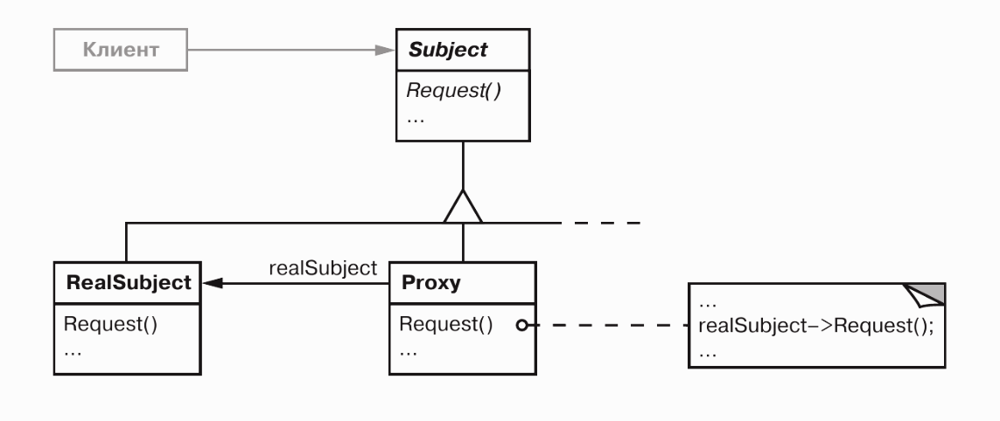
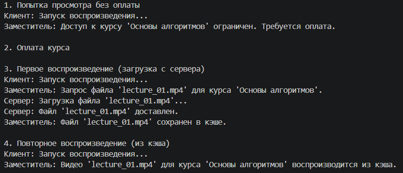

# Паттерн проектирования «Заместитель» (Proxy)

## Описание паттерна

Паттерн «Заместитель» — это структурный шаблон проектирования, который предоставляет объект-посредник, контролирующий доступ к другому объекту. Заместитель реализует тот же интерфейс, что и реальный объект, но перехватывает вызовы и добавляет к ним дополнительную инфраструктурную логику. Для клиента процесс взаимодействия не меняется: он продолжает вызывать те же методы, но между ним и реальной бизнес-логикой появляется управляемый слой.

Основная идея паттерна заключается в том, чтобы не изменять код самого объекта, а «обернуть» его в класс-заместитель, который берет на себя задачи по проверке прав, оптимизации или работе с сетью.

## Основные виды заместителей

В зависимости от реализуемой функциональности выделяют несколько основных разновидностей заместителя:

- **Защитный заместитель**
Контролирует доступ к объекту на основе прав пользователя или других атрибутов безопасности. Перед тем как передать вызов реальному объекту, заместитель проверяет, имеет ли клиент достаточно прав для выполнения операции.
- **Виртуальный заместитель**
Используется, когда создание реального объекта требует много ресурсов (памяти, времени или сетевых соединений). Заместитель создает настоящий объект только в тот момент, когда он действительно понадобился (при первом вызове метода). Это позволяет ускорить запуск приложения и экономить ресурсы.
- **Удалённый заместитель**
Представляет объект, находящийся в другом адресном пространстве, например, на удаленном сервере. Заместитель скрывает сложность сетевого взаимодействия: упаковку данных для передачи, установку соединения и обработку ошибок сети. Для клиента работа с удаленным объектом выглядит так же, как с локальным.
- **Кэширующий заместитель**
Сохраняет результаты затратных операций. При повторном запросе с теми же параметрами заместитель возвращает сохраненный результат, не обращаясь к реальному объекту. Это значительно снижает нагрузку на сервер и ускоряет работу системы.
- **Логирующий заместитель**
Фиксирует параметры вызовов, время выполнения, пользователя и результат. Заместитель записывает эти данные в системный журнал или систему мониторинга перед или после делегирования вызова. Это обеспечивает наблюдаемость системы без изменения кода целевого объекта.
- **Заместитель «Умная ссылка»**
Расширяет базовый доступ к объекту дополнительной служебной логикой. Обычно применяется для автоматического подсчёта активных ссылок, чтобы безопасно удалить объект при отсутствии пользователей, корректной работы при одновременных запросах или управления блокировками ресурсов.

## Графическое представление

Классическая структура паттерна изображена на схеме ниже:



### Описание элементов
*   **Subject (Субъект):** Интерфейс, который определяет общие методы для Реального Субъекта и Заместителя.
*   **RealSubject (Реальный Субъект):** Класс, содержащий основную бизнес-логику или выполняющий полезную работу.
*   **Proxy (Заместитель):** Класс, который хранит ссылку на объект Реального Субъекта. Он реализует интерфейс Субъекта и контролирует доступ к нему.
*   **Client (Клиент):** Код, который работает с объектами через интерфейс Субъекта, не зная, работает ли он напрямую или через Заместителя.

## Пример кода паттерна «Заместитель»

Ниже представлен классический пример реализации структуры паттерна на Python.

```python
from abc import ABC, abstractmethod

class Subject(ABC):
    """
    Определяет общий интерфейс для Реального Субъекта и Заместителя. Обеспечивает их взаимозаменяемость.
    """

    @abstractmethod
    def request(self) -> None:
        raise NotImplementedError("Метод должен быть реализован в подклассе")

class RealSubject(Subject):
    """
    Содержит основную бизнес-логику.
    """

    def request(self) -> None:
        print("RealSubject: Выполняет обработку запроса.")

class Proxy(Subject):
    """
    Заместитель. Контролирует доступ к объекту, добавляя проверку прав и логирование.
    """

    def __init__(self, real_subject: RealSubject) -> None:
        self._real_subject = real_subject

    def request(self) -> None:
        """
        Перехватывает вызов, проверяет доступ, делегирует выполнение и логирует результат.
        """

        if self.check_access():
            self._real_subject.request()
            self.log_access()

    def check_access(self) -> bool:
        print("Proxy: Выполняет проверку прав доступа.")
        return True

    def log_access(self) -> None:
        print("Proxy: Фиксирует время выполнения запроса.", end="")

def client_code(subject: Subject) -> None:
    """
    Клиентский код. Работает с объектами строго через интерфейс Subject.
    """
    
    subject.request()

if __name__ == "__main__":
    print("Запуск кода с использованием реального субъекта:")
    real_subject = RealSubject()
    client_code(real_subject)

    print("")

    print("Запуск кода с использованием Заместителя:")
    proxy = Proxy(real_subject)
    client_code(proxy)
```

## Формулировка задачи

**Область:** Онлайн-платформа для обучения.
**Проблема:** Видеоуроки хранятся на удалённом сервере. Файлы объёмные, их загрузка занимает время и создает нагрузку на сеть. Кроме того, доступ к курсам должен быть платным, а повторные просмотры одного и того же урока не должны повторно обращаться к серверу.

## Решение задачи

Для решения задачи реализован Заместитель, объединяющий функции защиты доступа, кэширования и работы с удалённым ресурсом.

```python
import time
from abc import ABC, abstractmethod


class ILesson(ABC):
    """
    Интерфейс учебного модуля.
    Определяет общие методы для Реального Субъекта и Заместителя.
    """

    @abstractmethod
    def play(self) -> None:
        """Запуск воспроизведения учебного материала."""
        raise NotImplementedError("Метод play() должен быть реализован в подклассе")


class VideoStream(ILesson):
    """
    Реальный Субъект.
    Имитирует тяжелый объект, расположенный на удалённом сервере.
    """

    def __init__(self, filename: str) -> None:
        self._filename = filename

    def play(self) -> None:
        print(f"Сервер: Загрузка файла '{self._filename}'...")
        time.sleep(2)  # Имитация сетевой задержки
        print(f"Сервер: Файл '{self._filename}' доставлен.")


class LessonProxy(ILesson):
    """
    Заместитель.
    Реализует защитный, кэширующий и удалённый контроль доступа.
    """

    def __init__(self, video_stream: VideoStream, course_title: str, is_paid: bool = False) -> None:
        self._video_stream = video_stream
        self._course_title = course_title
        self._is_paid = is_paid
        self._cache: set[str] = set()

    def play(self) -> None:
        filename = self._video_stream._filename

        # 1. Защитный заместитель
        if not self._is_paid:
            print(f"Заместитель: Доступ к курсу '{self._course_title}' ограничен. Требуется оплата.")
            return

        # 2. Кэширующий заместитель
        if filename in self._cache:
            print(f"Заместитель: Видео '{filename}' для курса '{self._course_title}' воспроизводится из кэша.")
            return

        # 3. Удалённый заместитель
        print(f"Заместитель: Запрос файла '{filename}' для курса '{self._course_title}'.")
        self._video_stream.play()
        
        self._cache.add(filename)
        print(f"Заместитель: Файл '{filename}' сохранен в кэше.")


def watch_lesson(proxy: ILesson) -> None:
    """
    Клиентский код.
    Работает исключительно через интерфейс ILesson, не зная о реализации.
    """
    print("Клиент: Запуск воспроизведения...")
    proxy.play()
    print()


if __name__ == "__main__":
    # Создаем технический объект (Видеофайл)
    video_file = VideoStream("lecture_01.mp4")

    # Создаем Заместителя, который управляет доступом к видеофайлу
    lesson_proxy = LessonProxy(video_file, course_title="Основы алгоритмов", is_paid=False)

    print("1. Попытка просмотра без оплаты")
    watch_lesson(lesson_proxy)

    print("2. Оплата курса")
    lesson_proxy_paid = LessonProxy(video_file, course_title="Основы алгоритмов", is_paid=True)
    print()

    print("3. Первое воспроизведение (загрузка с сервера)")
    watch_lesson(lesson_proxy_paid)

    print("4. Повторное воспроизведение (из кэша)")
    watch_lesson(lesson_proxy_paid)
```

### Разбор решения

1.  **Интерфейс `ILesson`:** Гарантирует, что и реальный поток, и заместитель имеют одинаковый метод `play()`. Клиент вызывает только его.
2.  **`VideoStream`:** Отвечает исключительно за имитацию сетевого запроса. Этот класс ничего не знает о правах доступа или кэше.
3.  **`LessonProxy`:** Перехватывает вызов метода `play()` и выполняет последовательную проверку:
    *   Сначала проверяет флаг оплаты. Если доступ закрыт, вызов блокируется сразу.
    *   Затем проверяет наличие файла в памяти (кэше). Если файл уже загружался, запрос к серверу не отправляется.
    *   Если файл не в кэше, Заместитель делегирует вызов реальному объекту `VideoStream` (удалённый доступ).
    *   После успешной загрузки сохраняет имя файла в кэш для будущих запросов.

### Результат работы программы



## Вывод

Паттерн «Заместитель» позволяет добавлять новые возможности, такие как проверка прав, кэширование или ведение журнала, без изменения исходного кода объекта. Основная задача объекта остаётся прежней и не усложняется, а все дополнительные проверки и оптимизации берет на себя класс-посредник. В реальных проектах это делает систему надёжнее, работу быстрее, а дальнейшую поддержку проще.
